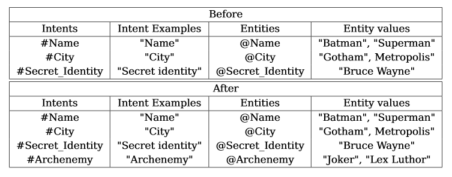

# Enrichment_Project
The code of the PoC of the cognitive corpus enrichment project, by Laurent Goujon and Elie Azeraf.

## Presentation
 
The corpus enrichment project is a project to enrich automatically cognitive corpus from an external corpus, depending on questions asked by a user to a chatbot. 

As an example, we have the following cognitive corpus (a JSON dataset in our example): <br />
 <br />
This dataset is linked with a chatbot. <br />
We also have an external corpus where the algorith will fetch the answer if the answer is not in our dataset (for the example we have all the Wikipedia articles).

A user comes and asks: <br />
 <br />
Here, the answer is in our dataset, so the chatbot will simply answer: <br />
 <br />
This is the very classical case.

But now, a user comes and asks: <br />
 <br />
As you can see, the answer is not in our dataset. <br />
Instead of answering "Sorry, I can't help you.", with our enricher algorithm, the user will have the answer in only 3s: <br />
 <br />
On the other hand, our dataset is enriched: <br />
 <br />

Indeed, thanks to an Open Domain Question Answering algorithm, we have the ability to find the answer in our external corpus. <br />
Moreover, for people who knows these chatbot concepts, the assistant parameters (intent, entity, dialog tree) are also enriched. <br />
 <br />

## Installation

### Cloning the project

First of all, clone or download the git project.
You can dowload by clicking on "Clone or Download" then "Download ZIP" and go in the folder, or in your command prompt:
```
git clone https://github.com/toto222/Enrichment_Project.git
cd Enrichment_Project
```
You must have Anaconda and node.js installed on your computer.

#### Installation of Anaconda

Go to this link: <a href="https://www.anaconda.com/download/">here</a>. <br />
Download the version of anaconda adapted to your computer with the Python 3.7 version. <br />
WARNING: during the installation, you have to mark the icon "Add Anaconda to my path environment variable."

### Python requirements

To use the algorithm and test our PoC, you have some installation to do. <br />
You must have 16Go of RAM to use the algorithm and OSX/Linux system. 

#### Creating a new environment

It is recommended to create a new environment on Anaconda:
```
conda create -n Enrichment_Project python=3.6
```
Now, activate this new environment, for Windows users:
```
activate Enrichment_Project
```
And for Linux/OSX users:
```
source activate Enrichment_Project
```

#### Installing the packages

First of all, you have to install PyTorch. <br />
If your computer have a compatible GPU with CUDA X.X:
```
conda install pytorch=0.4.0 cudaXX -c pytorch
```
Otherwise, if you don't have a GPU or if you don't want to use it:
```
conda install pytorch=0.4.0 -c pytorch
```

Then, run the following code on your command prompt: 
```
pip install -r requirements.txt
python setup.py develop
```

### Downloading files

To download all the file needed for the project, you have to dowload the data file  <a href="https://ibm.box.com/s/igyavfyg98kgfar3pm045jtu3q16oh0u">here</a>. <br />
Then, unzip it and place it in the Code_Enrichment_Project folder.

### Verification

Now, your folder must be like this:
```
Code_Enrichement_Project
|
-- data (folder)
-- drqa (folder)
-- Objects (folder)
-- scripts (folder)
-- main.py (python file)
-- setup.py (python file)
-- requirements.txt (text file)
```

## Demo

Now you can launch your algorithm on your command prompt (you much have your environment activated):
```
(Enrichment_Project) path/to/enrichment/project/folder> python main.py
```

You are asked of you want to see the logs, we send y for yes. <br />
Then, you have about 7 minutes of initialisation, after that you have the interactive mode: <br />


You can ask a question, see you dataset or your intents and entities. <br />
This is our dataset: <br />


We asked the question <br /> 
 <br />
This information is not in our dataset, but in only 3s the user have the answer. <br />
 <br />
Then, the dataset is being enriched, with the new information about the archennemy (we add this information for Batman, but also for Superman), then new intents and entities are created and adding. <br />
This is our enriched dataset: <br />
 

You can watch a video of this demo here: <br />
 <video width="320" height="240" controls>
  <source src="video/Enrichment_Project_Video.mp4" type="video/mp4"> 
Your browser does not support the video tag, the video is available in the video folder.
</video>

You can test the algorithm with many questions:
- What is the secret identity of Superman ?
- What is the city of Batman ? 

Sometimes, it is not working well, you can try:
- What is the city of Spider Man ?
